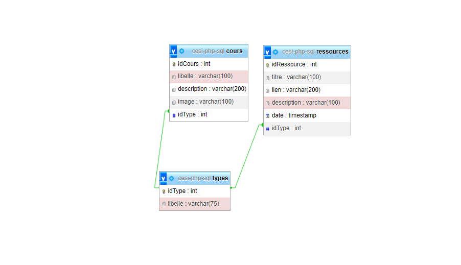
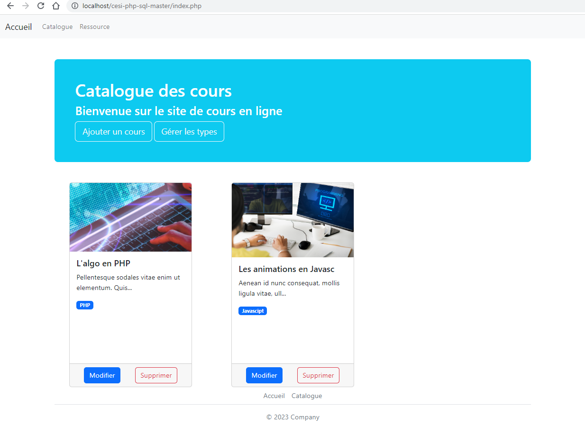

<h1 align="center" id="title">cesi-php-sql</h1>

<p id="description">Ce projet consiste a apprendre le php et le sql</p>

<h2>Project Screenshots:</h2>





  
  
<h2>🧐 Features</h2>

Here're some of the project's best features:

*   Voir les article sur l'accueil (index.php)
*   modifié / supprimé / ajouter des article
*   Voir la liste des types
*   ajouter et supprimer des types
*   Voir la liste des ressource sur la page ressource
*   ajouter et supprimer des ressources

<h2>🛠️ Installation Steps:</h2>

<p>1. Téléchargement</p>

```
Télécharger le dossier du projet ou récupérer le repo git 
```

<p>2. installation</p>

```
insérer le dossier entier dans votre serveur local
```

<p>3. bdd</p>

```
Importer le fichier sql dans votre gestionnaire de bdd
```

<p>4. Vérifié</p>

```
Vérifié la configuration de la bdd ainsi que la connexion dans le fichier "config/db.php"
```
